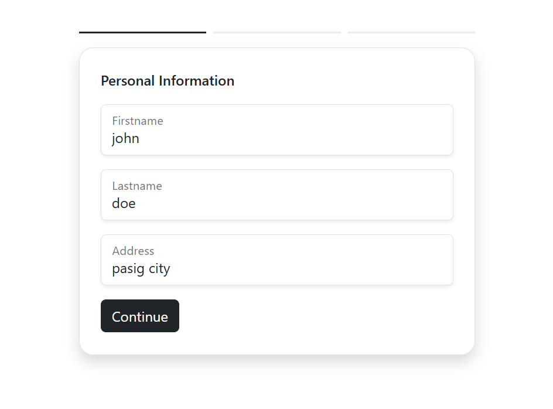
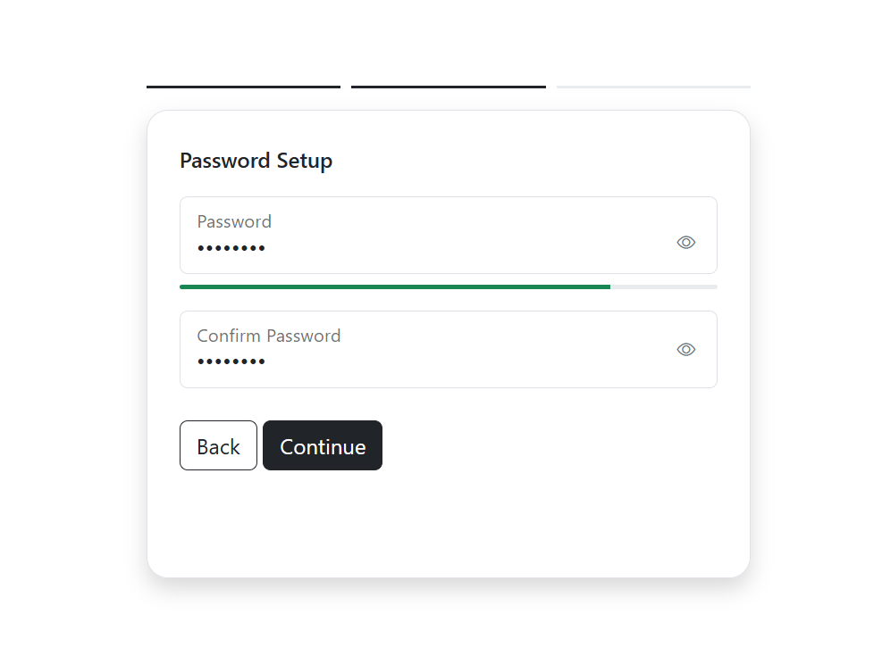
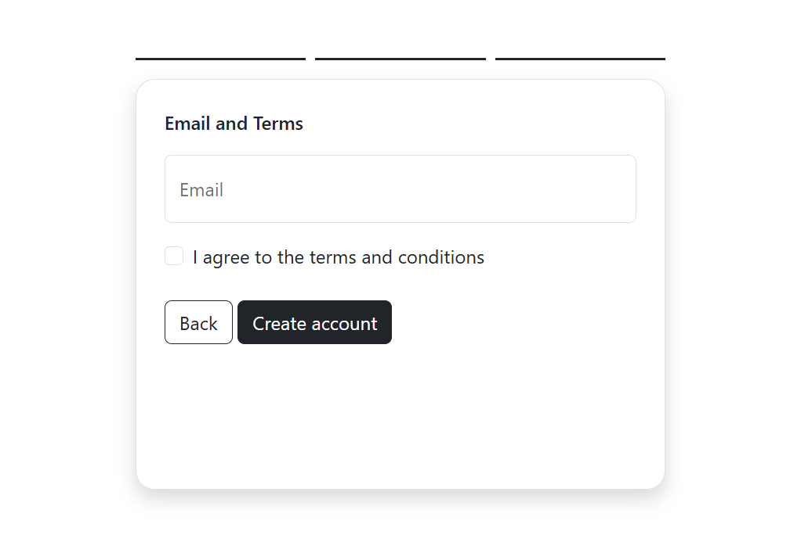
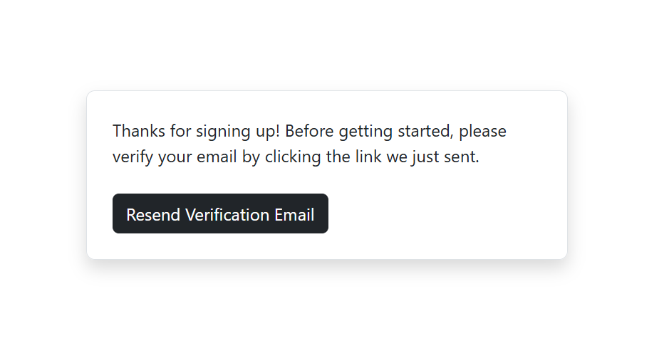
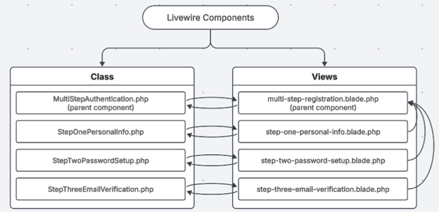

  
  

  
  

## About Laravel Livewire Multi-Step Authentication

The Multi-Step Authentication System is implemented using Laravel Livewire, which 
allows for a dynamic, component-based registration flow without full-page reloads. 
The system is divided into one parent component and three child components, each 
representing a step in the registration process.

### Workflow

## Architecture 
### Parent Component: MultiStepRegister 
**File Path:**
 - app/Livewire/Auth/MultiStepRegister.php 
 - resources/views/livewire/auth/multi-step-register.blade.php 
**Responsibilities:**
- Acts as the controller of the authentication flow. 
- Maintains $currentStep t-track the active form stage. 
- Listens for emitted events (goToStep) from child components. 
- Renders the appropriate Livewire component based on the current step. 
- Displays progress bars and manages transitions between steps. 
**Key Methods:** 
- setStep($step) – Updates the active step dynamically. 
- render() – Loads the appropriate child component int-the main layout. 
### Step 1: Personal Information 
**File Path:**
- app/Livewire/Auth/StepOnePersonalInfo.php 
- resources/views/livewire/auth/step-one-personal-info.blade.php 
**Responsibilities:** 
- Collects the user’s first name, last name, and address. 
- Validates input fields t-ensure completeness and proper format. 
- Temporarily stores user data in the session (registration key). 
- Emits an event t-move t-Step 2 ($this->dispatch('goToStep', 2)). 
**Validation Rules:** 
'first_name' => 'required|string|max:50', 
'last_name'  => 'required|string|max:50', 
'address'    => 'required|string|max:255', 
### Step 2: Password Setup 
**File Path:** 
- app/Livewire/Auth/StepTwoPasswordSetup.php 
- resources/views/livewire/auth/step-two-password-setup.blade.php 
**Responsibilities:** 
- Allows the user t-create and confirm a password. 
- Checks password strength dynamically using a custom method 
(checkStrength). 
- Uses Bootstrap progress bar t-visualize password strength. 
- Provides a toggle password visibility JavaScript function. 
- Saves temporary password data t-session storage. 
- Includes navigation methods: 
- submit() → validates and proceeds t-Step 3. 
- goBack() → returns t-Step 1. 
**Validation Rules:** 
'password' => 'required|min:8', 
'password_confirmation' => 'required|same:password', 
### Step 3: Email Verification 
**File Path:** 
- app/Livewire/Auth/StepThreeEmailVerification.php 
- resources/views/livewire/auth/step-three-email-verification.blade.php 
**Responsibilities:** 
- Collects and validates email and terms agreement. 
- Creates a new user record using data stored in session. 
- Hashes password using Laravel’s Hash::make(). 
- Logs in the user immediately after registration (Auth::login($user)). 
- Triggers Laravel’s email verification via event(new Registered($user)). 
- Redirects t-/email/verify for confirmation. 
**Validation Rules:** 
'email' => 'required|email|max:255|unique:users,email', 
'terms' => 'accepted', 
### Session Data Flow 
Each step temporarily stores user data in the session using: 
session()->put('registration', $registrationData); 
### User Experience (UX) Design 
- Bootstrap and Livewire are used for responsiveness and interactivity. 
- The form layout is minimal and centered vertically using vh-100 d-flex justify
content-center. 
- Each step includes clear labels, form-floating inputs, and smooth transitions. 
- Progress bars indicate the user’s registration progress visually. 
- Password visibility toggle and strength meter enhance usability. 

### Acknowledgment  
- This system documentation was developed with the assistance of ChatGPT (GPT-5) 
- by OpenAI, which provided guidance in structuring the system architecture, 
- explaining code logic, and improving documentation clarity. 
